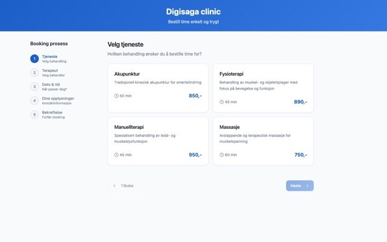
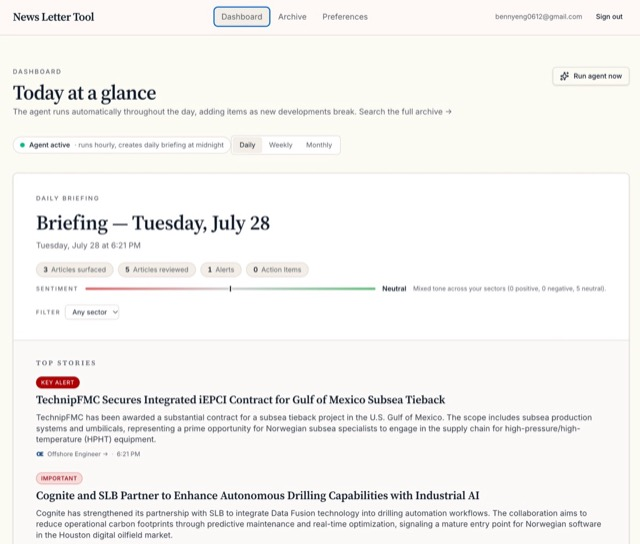
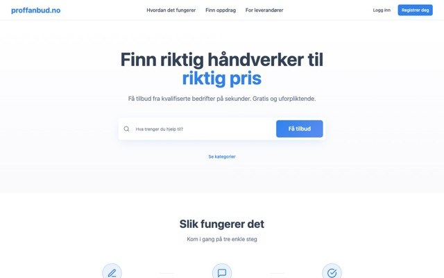
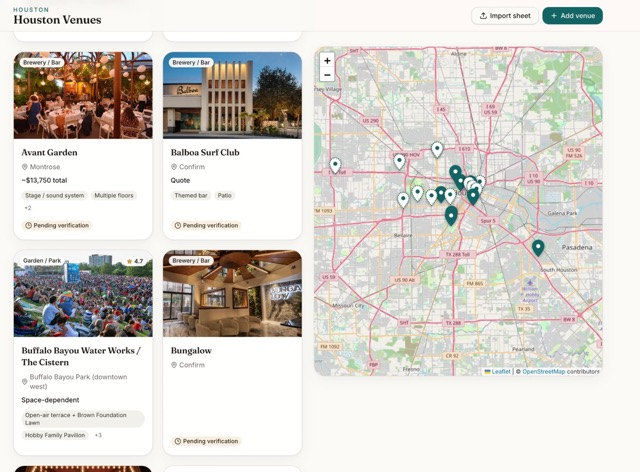
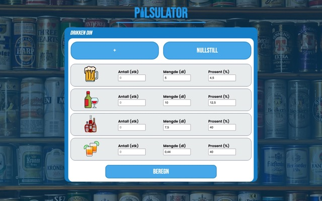
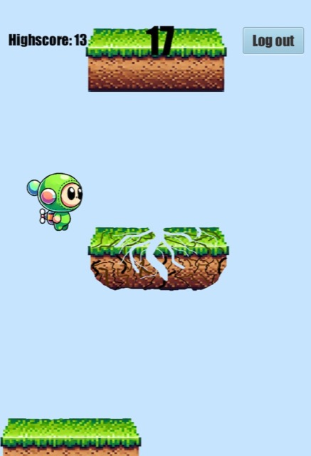
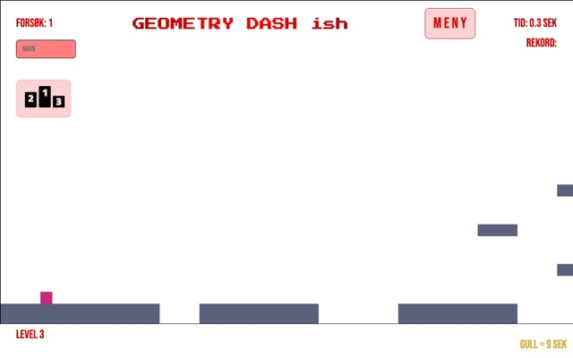
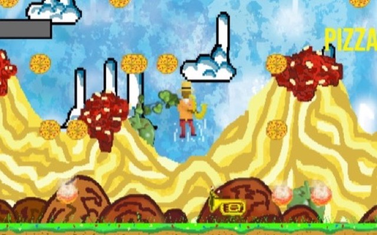

# Benjamin Eng

Student innenfor industriell økonomi og teknologiledelse ved NTNU. Utvikler web og AI-integrasjoner.

[Porteføljeside](https://benjamin-eng.vercel.app/) | [LinkedIn](https://www.linkedin.com/in/benjamin-eng-5a8385323/) | [E-post](mailto:bennyeng0612@gmail.com)

## Prosjekter

<table>
  <tr>
    <td width="33%" valign="top">
       
      <b>Peer</b> (2026) 
      Timebestilling og CRM for helseklinikker, med SMS-varsler. Sammen med Emil Skotner. 
      <a href="https://peer-booking.lovable.app">Booking</a>, <a href="https://peer-crm.lovable.app">CRM</a>
    </td>
    <td width="33%" valign="top">
       
      <b>CampusWear</b> (2026) 
      Gruppebestilling av skole-, revy- og russeklær, med designstudio for egen logo. 
      <a href="https://campuswear-azure.vercel.app">Åpne</a>, <a href="https://github.com/BenjaminKoder/everyday-hello-bot">Kode</a>
    </td>
    <td width="33%" valign="top">
       
      <b>Nyhetsbriefing for Innovasjon Norge</b> (2026) 
      AI-agent som overvåker nyheter og sender daglige briefinger til kontoret i Houston. 
      Internt verktøy
    </td>
  </tr>
  <tr>
    <td valign="top">
       
      <b>Anbudsportal</b> (2025) 
      Kobler privatpersoner med håndverkere. Sammen med Emil Skotner. 
      <a href="https://anbudsportal.lovable.app">Åpne</a>
    </td>
    <td valign="top">
       
      <b>DigiSaga</b> (2024–) 
      Nettsider og AI-automatisering for norske bedrifter. Sammen med Emil Skotner. 
      <a href="https://digisaga.no">digisaga.no</a>
    </td>
    <td valign="top">
       
      <b>Houston Venues</b> (2026) 
      Kart og database over lokaler og leverandører til arrangementer. 
      <a href="https://houston-venues.vercel.app">Åpne</a>, <a href="https://github.com/BenjaminKoder/houston-venues">Kode</a>
    </td>
  </tr>
  <tr>
    <td valign="top">
       
      <b>Pilsulator</b> (2022) 
      Promillekalkulator basert på Widmarks formel. 
      <a href="https://benjaminkoder.github.io/Spillsider/PilsKalkulator/index.html">Prøv</a>, <a href="https://github.com/BenjaminKoder/BenjaminKoder.github.io/tree/main/Spillsider/PilsKalkulator">Kode</a>
    </td>
    <td valign="top">
       
      <b>JumpyJump</b> (2025) 
      Plattformspill i JavaFX med innlogging, lagring og JUnit-tester, laget i TDT4100. 
      <a href="https://github.com/BenjaminKoder/jumpyjump-javafx">Kode</a>
    </td>
    <td valign="top">
       
      <b>Geometry Dash ish</b> (2022) 
      Plattformspill på HTML5 Canvas med 15 baner og ledertavle i Firebase. 
      <a href="https://benjaminkoder.github.io/Spillsider/Canvasgamefreestyle/index.html">Spill</a>, <a href="https://github.com/BenjaminKoder/BenjaminKoder.github.io/tree/main/Spillsider/Canvasgamefreestyle">Kode</a>
    </td>
  </tr>
  <tr>
    <td valign="top">
       
      <b>Shake That Jazz</b> (2023) 
      Pygame-spill med egne sprites og en butikk for oppgraderinger. 
      <a href="https://github.com/BenjaminKoder/shake-that-jazz">Kode</a>
    </td>
    <td></td>
    <td></td>
  </tr>
</table>

Mer om hvert prosjekt finnes på [porteføljesiden](https://benjamin-eng.vercel.app/).

## Tidligere prosjekter

- **Tallsystemer** – nettside om tallsystemer, bits og bytes. [Åpne](https://benjaminkoder.github.io/StorsteProsjekter/Tallsystemer/index.html), [Kode](https://github.com/BenjaminKoder/BenjaminKoder.github.io/tree/main/StorsteProsjekter/Tallsystemer)
- **Lykkehjul med database** – spinner med innlogging og ledertavle. [Åpne](https://benjaminkoder.github.io/Spillsider/SpinnerTob/saannBenjiVil/index.html), [Kode](https://github.com/BenjaminKoder/BenjaminKoder.github.io/tree/main/Spillsider/SpinnerTob/saannBenjiVil)
- **Lykkehjul med localStorage** – spinner som lagrer i nettleseren. [Åpne](https://benjaminkoder.github.io/Spillsider/SpinnerTycoon/Spinner.html), [Kode](https://github.com/BenjaminKoder/BenjaminKoder.github.io/tree/main/Spillsider/SpinnerTycoon)
- **Sirkelspillet** – skytespill i Pygame. [Kode](https://github.com/BenjaminKoder/forste-pygame)
- **Mario** – hoppespill i nettleseren. [Spill](https://benjaminkoder.github.io/StorsteProsjekter/shyguy/index.html), [Kode](https://github.com/BenjaminKoder/BenjaminKoder.github.io/tree/main/StorsteProsjekter/shyguy)
- **Klassequiz** – julequiz i Pygame. [Kode](https://github.com/BenjaminKoder/forste-pygame)

## Kompetanse

**Språk:** JavaScript, TypeScript, Python, Java, HTML og CSS

**Verktøy og rammeverk:** React, Supabase/Postgres, LLM-API-er, Resend, Twilio, Make.com, Firebase, JavaFX, JUnit, Pygame, Git og GitHub
